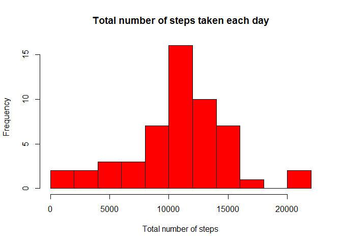
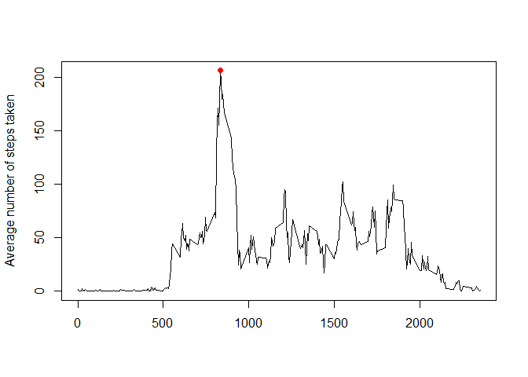
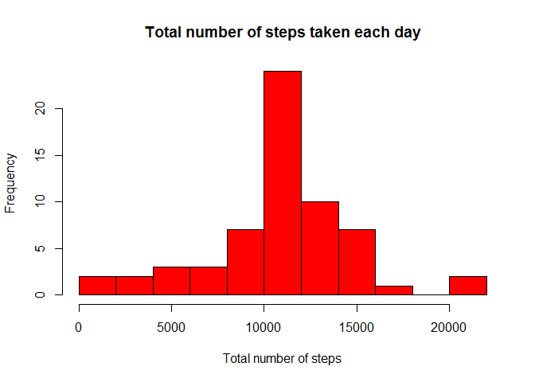

# Reproducible Research: Peer Assessment 1
Prepared by ZKP on the 9th of January 2016.

## Loading and preprocessing the data
The variables included in this dataset are:
<ol>
<li>steps: Number of steps taking in a 5-minute interval (missing values are coded as NA)</li>
<li>date: The date on which the measurement was taken in YYYY-MM-DD format</li>
<li>interval: Identifier for the 5-minute interval in which measurement was taken</li>
</ol>
The code below show how to load the data. There is no need to transform these data.


```r
data<-read.csv("activity.csv", header=TRUE, sep=",", na.strings = "NA")
summary(data)
```

```
##      steps                date          interval     
##  Min.   :  0.00   2012-10-01:  288   Min.   :   0.0  
##  1st Qu.:  0.00   2012-10-02:  288   1st Qu.: 588.8  
##  Median :  0.00   2012-10-03:  288   Median :1177.5  
##  Mean   : 37.38   2012-10-04:  288   Mean   :1177.5  
##  3rd Qu.: 12.00   2012-10-05:  288   3rd Qu.:1766.2  
##  Max.   :806.00   2012-10-06:  288   Max.   :2355.0  
##  NA's   :2304     (Other)   :15840
```

## What is mean total number of steps taken per day?
For this part of the assignment, I ignore the missing values in the dataset.<br>
First of all I calculate the total number of steps taken per day and draw a histogram. 


```r
library(dplyr)
```

```
## Warning: package 'dplyr' was built under R version 3.2.2
```

```
## 
## Attaching package: 'dplyr'
```

```
## The following objects are masked from 'package:stats':
## 
##     filter, lag
```

```
## The following objects are masked from 'package:base':
## 
##     intersect, setdiff, setequal, union
```

```r
data_sum<-summarize(group_by(data, date), total=sum(steps))
hist(data_sum$total, col="red", breaks=12, main="Total number of steps taken each day", xlab="Total number of steps")
```

\
The mean of the total number of steps taken per day is <b>10766</b>.<br>
The median of the total number of steps taken per day is <b>10765</b>.


## What is the average daily activity pattern?
To chech this I make a time series plot of the 5-minute interval and the average number of steps taken, averaged across all days.

```r
data_sum2<-summarize(group_by(data, interval), avg=mean(steps, na.rm = TRUE))
plot(data_sum2$interval, data_sum2$avg, type="l", xlab="", ylab="Average number of steps taken")
points(data_sum2 [which.max(data_sum2$avg), ][1,1], data_sum2 [which.max(data_sum2$avg), ][1,2], col="red", pch=16)
```

\

The 5-minute interval with the number <b>835</b> and value <b>206.1698113</b>, contains the maximum number of step on average across all the days in the dataset.

## Imputing missing values
The total number of missing values in the dataset is <b>2304</b>.<br>
I fill these values with the mean for that 5-minute interval and make a new histogram for that data.


```r
impute <- transform(data, steps=ifelse(is.na(steps), data_sum2$avg, steps))

impute_sum<-summarize(group_by(impute, date), total=sum(steps))
hist(impute_sum$total, col="red", breaks=12, main="Total number of steps taken each day", xlab="Total number of steps")
```

\

The mean of the total number of steps taken per day is <b>10766</b>.<br>
The median of the total number of steps taken per day is <b>10766</b>.<br>
The total daily number of steps increase from <b>570608</b> to <b>656737</b>.

## Are there differences in activity patterns between weekdays and weekends?
To calculate this I have to divide the dataset into a two groups and prepare a plot for both.


```r
library(lattice)
impute$date<-strptime(impute$date, "%Y-%m-%d")
weekdays1 <- c('poniedziałek', 'wtorek', 'środa', 'czwartek', 'piątek')

impute<-mutate(impute, weekdays=ifelse(weekdays(impute$date) %in% weekdays1, 'weekday', 'weekend'))
impute<-select(impute, steps, interval, weekdays)

impute_sum2<-summarize(group_by(impute, interval, weekdays), avg=mean(steps))

xyplot(avg ~ interval | weekdays, data = impute_sum2, layout = c(1, 2), type="l", xlab="Interval", ylab="Number of steps")
```

\
